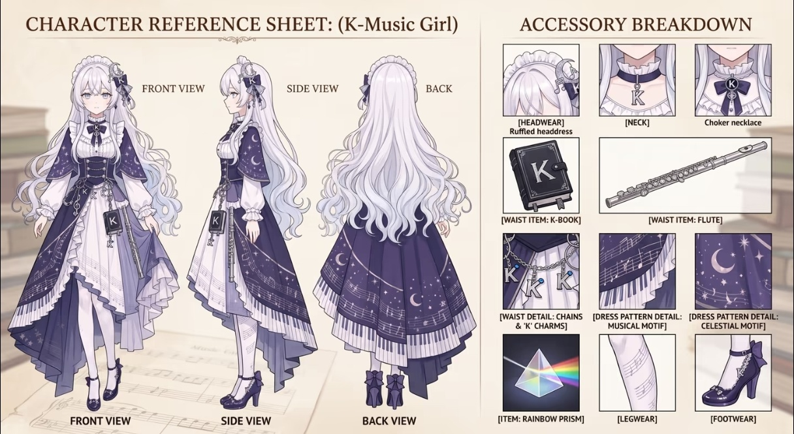

# world.execute(me)；

<p>
  <a href="LICENSE">
    
  </a>
  <a href="https://www.python.org/">
    
  </a>
  <a href="https://nodejs.org/">
    
  </a>
  <a href="https://playwright.dev/">
    
  </a>
</p>
<p>
  <a href="https://python-pillow.org/">
    
  </a>
  <a href="https://numpy.org/">
    
  </a>
  <a href="https://ffmpeg.org/">
    
  </a>
  <a href="https://pytorch.org/">
    
  </a>
</p>

<p align="left">
  
  
</p>

仓库：
- `build.py`：构建入口，负责串联全部制作步骤。
- `tools/`：歌词合成和舞者占位帧生成工具。
- `data/`：逐词时间、歌曲指纹和舞者帧清单等元数据。
- `film/kimi_web_frontend_20260927/`：左侧 Kimi 网页窗口的页面脚本、截图脚本、合成与补丁。
- `film/tui_pv_world_execute_20260926/`：右侧 TUI 引擎、镜头、连续性和转场资源。
- `film/mmd_motion_eval_20260927/pv_full.py`：舞者时间表。
- `film/third_party_references/kimi_reference_20261005/`：Kimi 立绘、背景、表情派生图及来源许可副本。
- `film/vendor/`：网页窗口使用的前端 CSS、JavaScript 和 Cordis 组件包。
- `docs/`：制作原理、字体配置、素材来源和本地化说明。

运行：
- Python 3.12+，装上 `pip install -r requirements.txt`；
- Node 20+；
- ffmpeg（在 PATH 里）；
- Windows 字体。在别的系统上可以换字体，见 [docs/FONTS.md](docs/FONTS.md)。
```bash
npm install
npx playwright install chromium # input/README.md
python build.py all             # 检查 → 歌词 → 替身舞者 → 页面截图 → 渲染
```
- 输出：`out/film.mp4` 是 1280×720 成片；`out/film_master.mp4` 是无损母版；加 `--4k` 时另有 `out/film_4k.mp4`。
- 耗时：CPU 渲染全片大约十几分钟到半小时，取决于核数。有 CUDA 版 torch 时，加 `--gpu --python <那个 python>` 会快很多。
- 分步：每一步也可以单独跑，`python build.py <check|lyrics|dancer|pages|render>`。

许可：

- 音乐：Mili - world.execute(me);
- 角色：Kimi；立绘、背景和表情参考上游资产，完整来源与许可见 `film/third_party_references/kimi_reference_20261005/sources/`
- 协议：MIT，见 [LICENSE](LICENSE)。repo fork自 [MisakaZentai](world-execute-me-dsh-pv)；仓库的组织方式参考了 [pdoom-video](https://github.com/mexicat/pdoom-video)
- 美术：Kimi 立绘、背景和表情改编自上游资产，按其 CC BY-NC-SA 4.0 署名链分享；使用时保留 `film/third_party_references/kimi_reference_20261005/sources/` 中的许可副本，注明改动，不得商用，改编部分按同协议分享。此声明不授予音乐、其他模型/动作或商标的权利。
- 字体：SIL OFL 1.1。

非官方同人作品，第三方清单见 [NOTICE.md](NOTICE.md)，一手授权来源和核实范围见 [docs/ASSET_SOURCES.md](docs/ASSET_SOURCES.md)。
